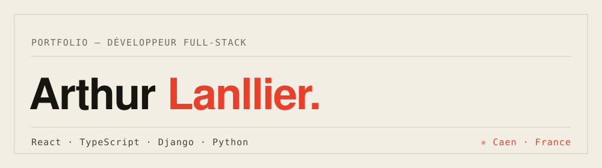

# Portfolio

Salut ! 👋 C'est mon portfolio personnel — un site tout simple en **HTML / CSS / JS**, sans framework, pour me présenter et montrer ce que je construis.

On y trouve :
- un petit mot sur mon parcours (de la filière littéraire au développement web),
- ma stack du moment (React, TypeScript, Django, Python...),
- quelques projets sur lesquels j'ai travaillé,
- et un moyen de me contacter.

## Voir le site

Ouvre simplement `index.html` dans ton navigateur, aucune installation n'est nécessaire.

## Fait avec

HTML · CSS · JS — pas de build, pas de dépendances, juste du code écrit à la main.

---

Merci d'être passé·e par ici ✨
